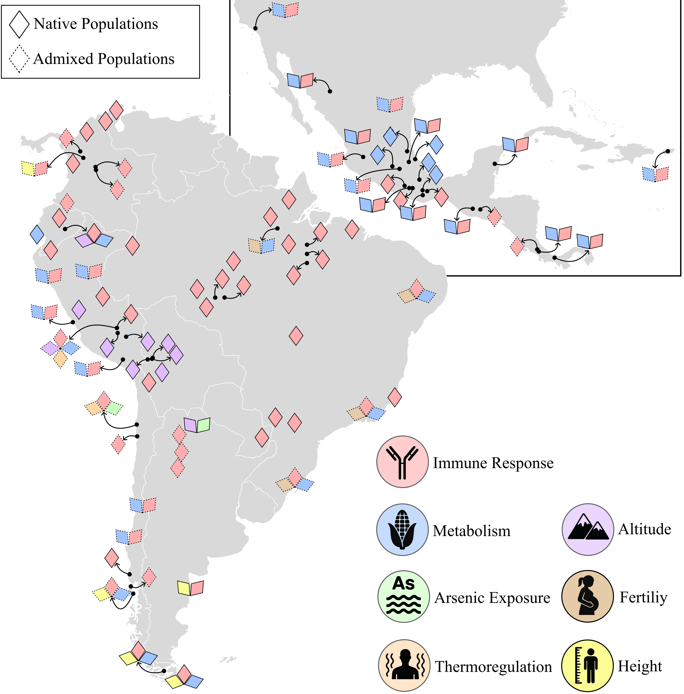

selective pressures# SelectionMapLatam

This repository accompanies the chapter “Evidence and Impact of Natural Selection in Latin American Populations” from the book Human Genetics in Latin America – Latin American Admixture and Human Diseases.

The main goal of this work is to explore how evolutionary pressures have shaped the genetic landscape of Latin American populations, highlighting both the evidence of natural selection and its implications for health and disease.

# Repository Scope

## Map of documented Adaptive Selection in Latin Americans

A visual representation of the geographic distribution of populations in Latin America that have been under adaptive selection that was detected through genomic scans and selection signatures. This map allows for an intuitive understanding of geographic and population-level patterns.

## Interactive Map of Adaptive Selection in Latin Americans

👉 [Open Interactive Map](https://ravuch.github.io/SelectionMapLatam/Selection_Map.html)
*Figure 2. Interactive version of the map showing populations in Latin America with evidence of adaptive selection. Hover or click on each point to explore geographic coordinates, selective pressures, and bibliographic references.*

## Source data

This map was created from a curated data table compiling the genetic loci, populations studied, and associated selective pressures that we identified in the scientific literature by August 2025. This dataset is made available for further analysis and reproducibility [here](SelectionStudies.md).

# Objectives

* Provide open access to the underlying data and visualizations presented in the chapter.
* Support researchers, educators, and students interested in population genetics, admixture, and human evolution in Latin America.
* Highlight the impact of natural selection signals on biomedical and evolutionary studies.

# Authors

**Ricardo Alejandro Verdugo Salgado, MV, PhD**
Departamento de Oncología Básico Clínica
Facultad de Medicina. Campus Occidente
Universidad de Chile

**Patricio Pezo-Valderrama, PhD**
Institut de Biologia Evolutiva
CSIC-Universitat Pompeu Fabra

**Kelly Nunes, PhD**
Departamento de Genética e Biologia Evolutiva
Instituto de Biociências
Universidade de São Paulo

# Contact information

Questions and comments should be directed to Ricardo Verdugo raverdugo at uchile.cl
